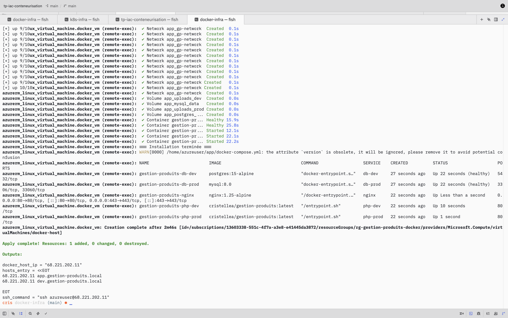
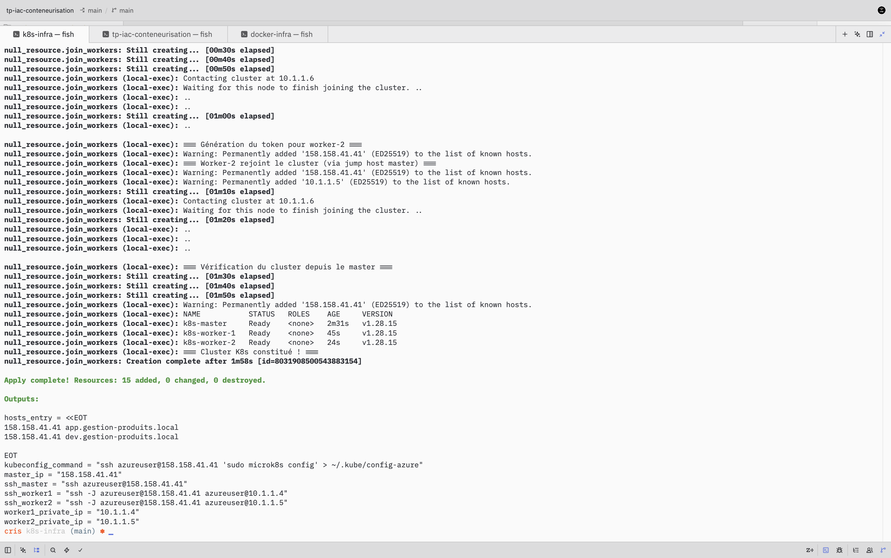
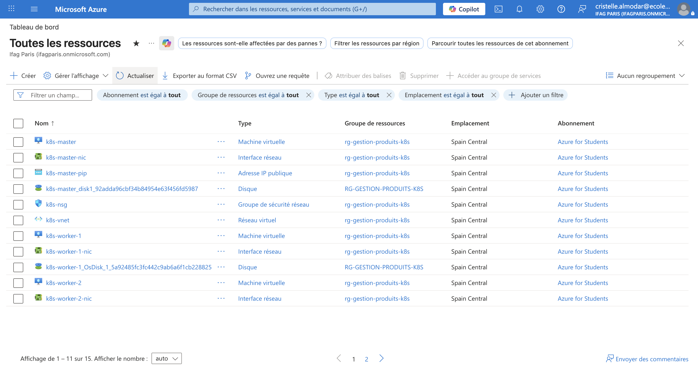
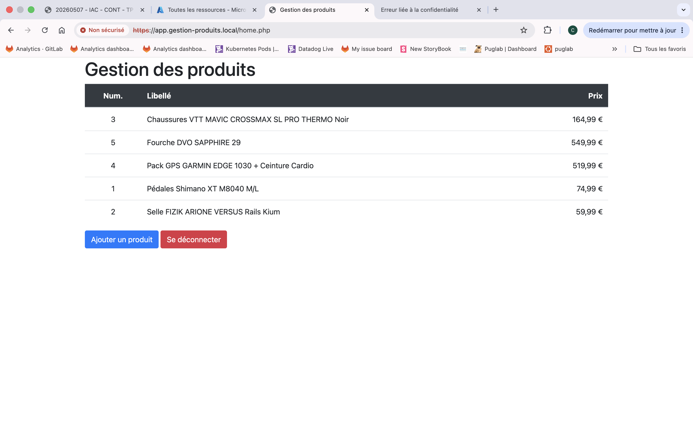
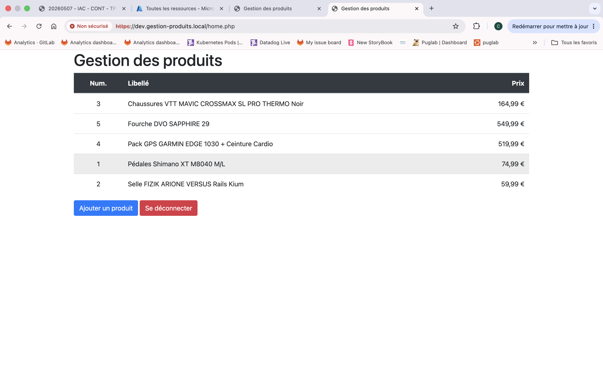

# TP IaC ≡ Conteneurisation avancée ≡ M1 DEV EPSI

Application PHP de gestion de produits déployée sur Docker et Kubernetes (MicroK8s) via Terraform sur Azure.

---

**URLs d'accès** (identiques sur Docker local et K8s Azure) **:**
- `https://app.gestion-produits.local` → version prod (MySQL 8.0)
- `https://dev.gestion-produits.local` → version dev (PostgreSQL 15)

> Le HTTP (port 80) redirige automatiquement vers HTTPS (port 443).
> Le certificat TLS est auto-signé : le navigateur affichera un avertissement de sécurité, cliquer sur **"Avancer quand même"** (Chrome) ou **"Accepter le risque"** (Firefox).

---

## Structure du projet

```
├── php/www/                       Application PHP (CRUD gestion de produits)
├── database/
│   ├── gestion_produits.sql       Schéma MySQL (prod)
│   └── gestion_produits_pg.sql    Schéma PostgreSQL (dev)
├── docker/
│   ├── Dockerfile                 Image php:8.2-apache + pdo_mysql + pdo_pgsql
│   ├── entrypoint.sh              Initialisation des images de démo au démarrage
│   └── nginx/
│       ├── nginx.conf             Reverse proxy Nginx (2 virtual hosts HTTPS)
│       └── certs/                 Certificats TLS auto-signés (générés localement)
├── docker-compose.yml             Stack complète (Nginx + MySQL + PostgreSQL + 2 PHP)
├── .env.example                   Variables d'environnement à copier en .env
├── terraform/
│   ├── docker-infra/              IaC : 1 VM Azure (spaincentral) + Docker Compose
│   │   ├── main.tf
│   │   ├── variables.tf
│   │   ├── outputs.tf
│   │   ├── terraform.tfvars.example
│   │   └── scripts/setup-docker.sh
│   └── k8s-infra/                 IaC : 3 VMs Azure (spaincentral) + cluster MicroK8s
│       ├── main.tf
│       ├── variables.tf
│       ├── outputs.tf
│       ├── terraform.tfvars.example
│       └── scripts/
│           ├── setup-master.sh    Installe MicroK8s + active dns/ingress/storage
│           ├── setup-worker.sh    Installe MicroK8s sur les workers
│           └── join-workers.sh    Joint les workers au cluster (exécuté en local)
├── kubernetes/
│   ├── prod/                      Manifests K8s namespace prod (MySQL)
│   └── dev/                       Manifests K8s namespace dev (PostgreSQL)
└── scripts/
    ├── build-push.sh              Build + push de l'image sur Docker Hub
    ├── deploy-k8s.sh              Déploiement des manifests sur le cluster
    └── generate-certs.sh          Génération des certificats TLS auto-signés
```

---

## Prérequis

```bash
# Outils nécessaires
brew install azure-cli terraform kubectl

# Authentification Azure
az login

# Clé SSH (si inexistante)
ssh-keygen -t rsa -b 4096 -f ~/.ssh/id_rsa
```

---

## Étape 1: Test local avec Docker Compose

```bash
# Variables d'environnement
cp .env.example .env

# Lancer la stack complète (Nginx + MySQL + PostgreSQL + 2 PHP)
docker compose up --build -d

# Résolution DNS locale
echo "127.0.0.1 app.gestion-produits.local" | sudo tee -a /etc/hosts
echo "127.0.0.1 dev.gestion-produits.local" | sudo tee -a /etc/hosts
```

- `https://app.gestion-produits.local` → MySQL (prod)
- `https://dev.gestion-produits.local` → PostgreSQL (dev)
- Identifiants : `admin` / `password`
- Certificat auto-signé: ignorer l'avertissement du navigateur

```bash
# Arrêter
docker compose down
```

---

## Étape 2: Build et push de l'image Docker

```bash
docker login

# L'option --platform linux/amd64 est nécessaire sur Mac Apple Silicon
chmod +x scripts/build-push.sh
./scripts/build-push.sh VOTRE_USERNAME_DOCKERHUB
```

L'image est publiée sur Docker Hub sous `cristellea/gestion-produits:latest`.

---

## Étape 3: Infrastructure Docker sur Azure (Terraform)

> **Important (compte étudiant) :** si le cluster K8s est déjà déployé, le détruire d'abord (`terraform destroy` dans `k8s-infra`): quota de 6 cœurs partagé.

Crée 1 VM Ubuntu 22.04 (`Standard_D2s_v3`) sur Azure en région `spaincentral`, installe Docker et lance la stack via `docker compose`.

```bash
cd terraform/docker-infra

# Variables Terraform (déjà configurées: vérifier les chemins SSH si besoin)
cp terraform.tfvars.example terraform.tfvars
# Valeurs à renseigner :
#   ssh_public_key_path  = "~/.ssh/id_rsa.pub"
#   ssh_private_key_path = "~/.ssh/id_rsa"

terraform init
terraform apply
```



Récupérer l'IP publique et mettre à jour `/etc/hosts` :

```bash
terraform output hosts_entry
# Exemple de sortie :
#   X.X.X.X app.gestion-produits.local
#   X.X.X.X dev.gestion-produits.local

terraform output -raw hosts_entry | sudo tee -a /etc/hosts
```

```bash
# Détruire l'infrastructure (libère les crédits Azure)
terraform destroy
```

---

## Étape 4: Cluster Kubernetes MicroK8s sur Azure (Terraform)

> **Important (compte étudiant) :** détruire l'infra Docker avant de créer le cluster K8s
> (quota de 6 cœurs partagé entre les deux déploiements).

Crée 3 VMs en `spaincentral` (master `Standard_D2s_v3` + 2 workers `Standard_D2as_v4`), installe MicroK8s sur chacune et constitue le cluster automatiquement.

```bash
cd terraform/k8s-infra

# Variables Terraform (déjà configurées: vérifier les chemins SSH si besoin)
cp terraform.tfvars.example terraform.tfvars
# Valeurs à renseigner :
#   ssh_public_key_path  = "~/.ssh/id_rsa.pub"
#   ssh_private_key_path = "~/.ssh/id_rsa"

# Rendre les scripts exécutables (obligatoire)
chmod +x scripts/*.sh

terraform init
terraform apply
```



Terraform effectue dans l'ordre :
1. Création des 15 ressources Azure (réseau, VMs…)
2. Installation de MicroK8s sur le master (`setup-master.sh` en remote-exec)
3. Installation de MicroK8s sur les workers (`setup-worker.sh` en remote-exec via le master en bastion)
4. Jonction des workers au cluster (`join-workers.sh` en local-exec depuis le Mac)

Récupérer le kubeconfig :

```bash
# IP affichée par terraform output
terraform output ssh_master
# → ssh azureuser@X.X.X.X

ssh azureuser@$(terraform output -raw master_ip) 'sudo microk8s config' > ~/.kube/config-azure
export KUBECONFIG=~/.kube/config-azure

kubectl get nodes
```

Résultat attendu :

```
NAME           STATUS   ROLES    AGE   VERSION
k8s-master     Ready    <none>   5m    v1.28.15
k8s-worker-1   Ready    <none>   3m    v1.28.15
k8s-worker-2   Ready    <none>   3m    v1.28.15
```



Accès SSH aux workers (via le master comme jump host) :

```bash
# Commandes affichées par terraform output
terraform output ssh_worker1
terraform output ssh_worker2
```

```bash
# Détruire le cluster
terraform destroy
```

---

## Étape 5: Déploiement de l'application sur K8s

Le script `deploy-k8s.sh` effectue dans l'ordre :
1. Génération d'un certificat TLS auto-signé (SAN pour les deux domaines)
2. Déploiement du namespace **prod** : MySQL + PHP + Ingress HTTPS
3. Déploiement du namespace **dev** : PostgreSQL + PHP + Ingress HTTPS
4. Attente que les pods soient `Running`

```bash
# Depuis la racine du projet, avec KUBECONFIG positionné
export KUBECONFIG=~/.kube/config-azure

chmod +x scripts/deploy-k8s.sh
./scripts/deploy-k8s.sh
```

Mettre à jour `/etc/hosts` avec l'IP du master :

```bash
MASTER_IP=$(cd terraform/k8s-infra && terraform output -raw master_ip)
# Supprimer les entrées existantes pour éviter les doublons, puis ajouter
sudo sed -i '' '/gestion-produits.local/d' /etc/hosts
echo "$MASTER_IP app.gestion-produits.local" | sudo tee -a /etc/hosts
echo "$MASTER_IP dev.gestion-produits.local" | sudo tee -a /etc/hosts
```

Vérifier l'état du déploiement :

```bash
kubectl get pods,svc,ingress -n prod
kubectl get pods,svc,ingress -n dev
```

Accéder à l'application (certificat auto-signé — ignorer l'avertissement du navigateur) :

| URL | Environnement | Base de données |
|-----|--------------|-----------------|
| `https://app.gestion-produits.local` | Production | MySQL 8.0 |
| `https://dev.gestion-produits.local` | Développement | PostgreSQL 15 |

Identifiants : `admin` / `password`





---

## Modifications PHP apportées

L'application d'origine était uniquement compatible MySQL. Trois fichiers ont été modifiés pour supporter MySQL et PostgreSQL via la variable d'environnement `DB_TYPE`.

| Fichier | Modification | Raison |
|---------|-------------|--------|
| `php/www/connect.php` | Connexion via variables d'environnement, bascule PDO mysql/pgsql selon `DB_TYPE` | L'original avait les credentials en dur |
| `php/www/auth.php` | Hash SHA256 calculé côté PHP (`hash('sha256', ...)`) | `SHA2()` est une fonction MySQL uniquement |
| `php/www/validation.php` | `lastInsertId('table_id_seq')` pour PostgreSQL | PostgreSQL requiert le nom de la séquence |

---

## Choix techniques

| Composant | Technologie | Justification |
|-----------|-------------|---------------|
| Application | PHP 8.2 + Apache | Existant dans le TP, image officielle stable |
| Reverse proxy Docker | Nginx 1.25 Alpine | Léger, virtual hosts simples |
| IaC | Terraform + provider AzureRM 4.x | Standard industrie, déclaratif |
| Cloud | Azure for Students | 100 $ de crédits, sans CB |
| VM docker-infra | Standard_D2s_v3 (2 vCPU, 8 GB) | SKU disponible en spaincentral sur compte étudiant |
| VM k8s master | Standard_D2s_v3 (2 vCPU, 8 GB) | Dans le quota `standardDSv3Family` |
| VM k8s workers | Standard_D2as_v4 (2 vCPU, 8 GB) | Famille différente pour répartir le quota par famille |
| Distribution K8s | MicroK8s 1.28 (Canonical) | Installation en une commande via snap, add-ons intégrés |
| Stockage K8s | MicroK8s `storage` add-on | Zéro configuration pour une démo |
| Ingress K8s | MicroK8s `ingress` add-on (Nginx) | Intégré, activé en une commande |

---

## Contraintes du compte Azure Étudiant

> Ces contraintes sont propres au compte **Azure for Students**.
> Sur un compte Azure standard ou Pay-As-You-Go, elles ne s'appliquent pas.

### Quotas rencontrés en région `spaincentral`

| Contrainte | Limite | Impact |
|---|---|---|
| IP publiques Standard | 3 max | Impossible d'attribuer une IP publique à chaque VM |
| Cœurs `standardDASv4Family` | 4 max | Insuffisant pour 3 VMs `Standard_D2as_v4` (= 6 cœurs) |
| Cœurs `standardDSv3Family` | 4 max | Insuffisant pour 3 VMs `Standard_D2s_v3` de même famille |
| Cœurs totaux région | 6 max | `docker-infra` (2 cœurs) et `k8s-infra` (6 cœurs) ne peuvent coexister |
| Régions disponibles | Liste restreinte | `westeurope` bloqué par policy Azure ; `spaincentral` autorisé |

### Adaptations retenues

- **Une seule IP publique** sur le master: les workers sont en IP privée uniquement, accessibles en SSH via le master comme bastion (jump host).
- **Deux familles de VM différentes** : master en `Standard_D2s_v3` (famille DSv3, 2 cœurs) et workers en `Standard_D2as_v4` (famille DASv4, 2 cœurs chacun). Cela répartit la consommation sur deux quotas de famille (2 + 4 = quotas distincts) tout en restant dans le quota total de 6 cœurs.
- **Déploiements mutuellement exclusifs** : détruire `docker-infra` avant de déployer `k8s-infra`.

### Ordre de déploiement obligatoire (compte étudiant)

```bash
# 1. Détruire docker-infra s'il est actif (libère 2 cœurs)
cd terraform/docker-infra
terraform destroy -auto-approve

# 2. Déployer le cluster K8s
cd ../k8s-infra
chmod +x scripts/*.sh
terraform apply
```

> Sur un compte Azure standard, les deux infras peuvent coexister et n'importe quelle VM size peut être utilisée.
